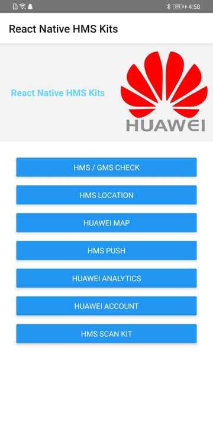
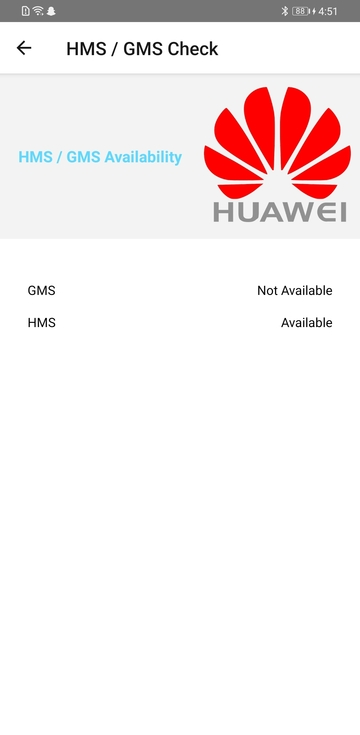
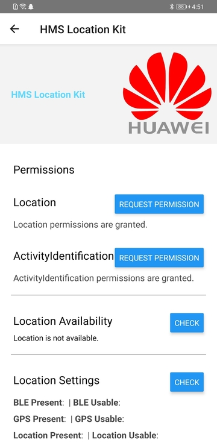
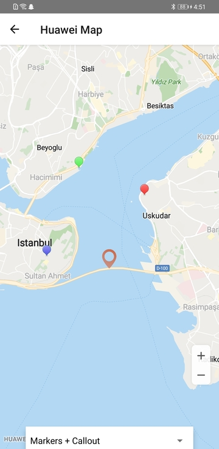
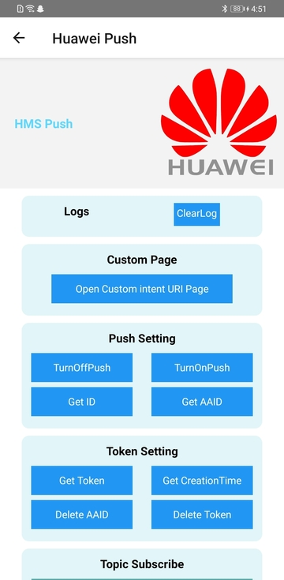
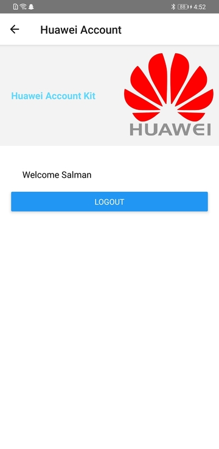
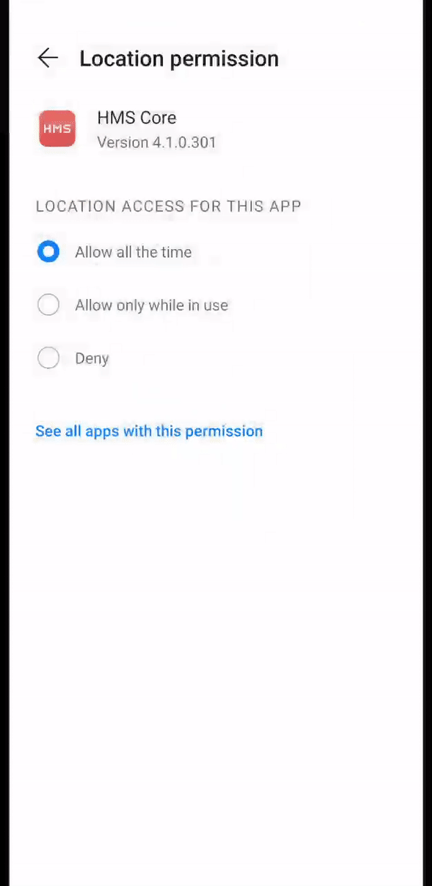

# React Native All HMS Kits

In this repository we try to combine all **HMS React Native Kits** in one Project!

React Native HMS packages integrated in this project:

1.  **HMS / GMS Availability Checker.**
2.  **HMS Location Kit.**
3.  **Huawei Map.**
4.  **HMS Push Kit.**
5.  **Huawei Analytics Kit.**
6.  **Huawei Account Kit.**

## Dowload APK

For testing of React Native project, please [donwload](https://github.com/salmanyaqoob/React-Native-HMS-All-Kits/raw/master/apks/rn-all-hms-kits-release.apk) the apk file.

## Screenshots

### Application

### Screenshots

  

  

 

## How to build a React Native Android Library

Please read this [article](https://medium.com/@mitchclay0/how-to-build-a-react-native-android-library-5c1eb22d17e1) to have idea about how to make your own customize React Native Android Library.

## Install plugins to Project

    yarn add ./hms-packages/react-native-ha-interface
    yarn add ./hms-packages/react-native-hms-location
    yarn add ./hms-packages/react-native-hms-map
    yarn add ./hms-packages/react-native-hwpush
    yarn add ./hms-packages/react-native-hms-ads

## Remove plugins to Project

    yarn remove react-native-ha-interface
    yarn remove react-native-hms-location
    yarn remove react-native-hms-map
    yarn remove react-native-hwpush
    yarn remove react-native-hms-ads

## Enabling/Disabling the Debug Mode for Analytics

    adb shell setprop debug.huawei.hms.analytics.app <YOUR-PACKAGE-NAME>
    shell setprop debug.huawei.hms.analytics.app .none.

## Official HMS Resources

### HMS All Plugins:

[https://developer.huawei.com/consumer/en/doc/overview/HMS-Core-Plugin](https://developer.huawei.com/consumer/en/doc/overview/HMS-Core-Plugin)

### Huawei Map Kit:

#### Codelab:[https://developer.huawei.com/consumer/en/codelab/HMSMapKit/index.html#0](https://developer.huawei.com/consumer/en/codelab/HMSMapKit/index.html#0)

#### Document:[https://developer.huawei.com/consumer/en/doc/development/HMS-Guides/hms-map-v4-abouttheservice](https://developer.huawei.com/consumer/en/doc/development/HMS-Guides/hms-map-v4-abouttheservice)

#### Sample Code:[https://developer.huawei.com/consumer/en/doc/development/HMS-Examples/hms-map-v4-example-rn](https://developer.huawei.com/consumer/en/doc/development/HMS-Examples/hms-map-v4-example-rn)

#### SDK Library: [https://developer.huawei.com/consumer/en/doc/development/HMS-Library/hms-map-v4-sdkdownload-rn](https://developer.huawei.com/consumer/en/doc/development/HMS-Library/hms-map-v4-sdkdownload-rn)

### Huawei Location Kit:

#### Codelab: [https://developer.huawei.com/consumer/en/codelab/HMSLocationKit/index.html#0](https://developer.huawei.com/consumer/en/codelab/HMSLocationKit/index.html#0)

#### Document: [https://developer.huawei.com/consumer/en/doc/development/HMS-Guides/location-introduction](https://developer.huawei.com/consumer/en/doc/development/HMS-Guides/location-introduction)

#### Sample Code: [https://developer.huawei.com/consumer/en/doc/development/HMS-Examples/locationSampleCode-rn](https://developer.huawei.com/consumer/en/doc/development/HMS-Examples/locationSampleCode-rn)

#### SDK Library: [https://developer.huawei.com/consumer/en/doc/development/HMS-Library/sdk_download_v4-rn](https://developer.huawei.com/consumer/en/doc/development/HMS-Library/sdk_download_v4-rn)

### Push Kit:

#### Codelab: [https://developer.huawei.com/consumer/en/codelab/HMSPushKit/index.html#0](https://developer.huawei.com/consumer/en/codelab/HMSPushKit/index.html#0)

#### Document: [https://developer.huawei.com/consumer/en/doc/development/HMS-Guides/push-introduction](https://developer.huawei.com/consumer/en/doc/development/HMS-Guides/push-introduction)

#### Client-side code: [https://developer.huawei.com/consumer/en/doc/development/HMS-Examples/push-example-rn](https://developer.huawei.com/consumer/en/doc/development/HMS-Examples/push-example-rn)

#### SDK Library: [https://developer.huawei.com/consumer/en/doc/development/HMS-Examples/push-example-rn](https://developer.huawei.com/consumer/en/doc/development/HMS-Examples/push-example-rn)

#### Push Kit Server Side code SDK:

**Supporting Language** (Java, C#, Python, GoLang, PHP, Node.js)

[https://developer.huawei.com/consumer/en/doc/development/HMS-Examples/push-serverjavasdk](https://developer.huawei.com/consumer/en/doc/development/HMS-Examples/push-serverjavasdk)

### Analytics Kit:

#### Codelab: [https://developer.huawei.com/consumer/en/codelab/HMSAnalyticsKit-ReactNative/index.html#0](https://developer.huawei.com/consumer/en/codelab/HMSAnalyticsKit-ReactNative/index.html#0)

#### Document: [https://developer.huawei.com/consumer/en/doc/development/HMS-Guides/react-native-development](https://developer.huawei.com/consumer/en/doc/development/HMS-Guides/react-native-development)

#### SDK Library: [https://developer.huawei.com/consumer/en/codelab/HMSAnalyticsKit-ReactNative/index.html#2](https://developer.huawei.com/consumer/en/codelab/HMSAnalyticsKit-ReactNative/index.html#2)
